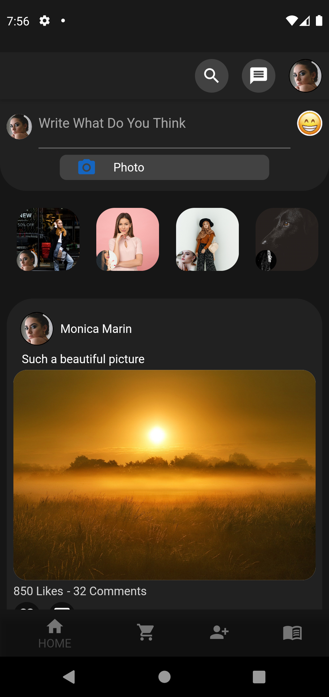
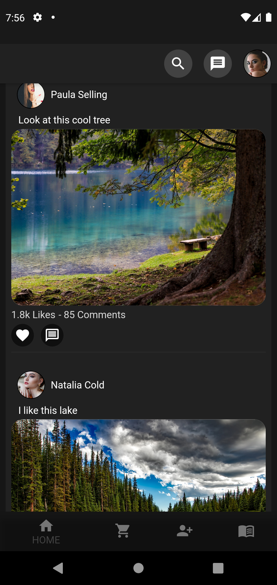
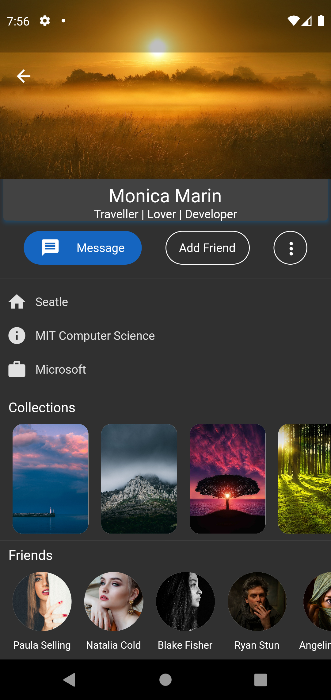
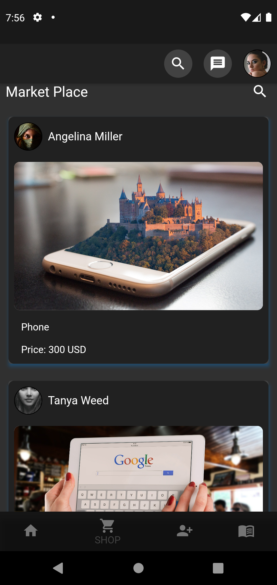
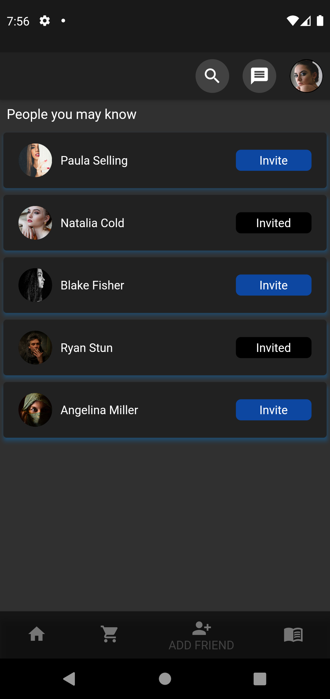

# flutter_social_media_app_sample_simple

Example of a simple social media app made using Flutter. I used provider for state management. The application is still under development. In the next stage, I plan to design a login page with firebase and perform authencation. 

  
  
  
  
  
  
  

